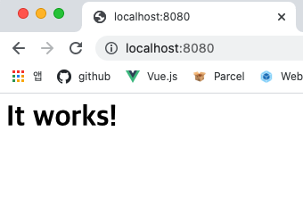
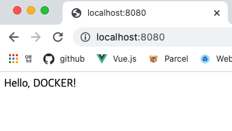
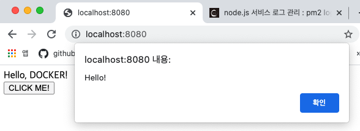

# Docker - 튜토리얼

## 도커는 무엇을 해결할까?

Environment Disparity, 개발 환경이 맞지 않아서 생기는 문제들을 해결해줍니다..

예를 들어서, 오늘 중요한 약속이 있어서 로컬에 코드를 구현을 다 해놓고 테스트까지 완벽하게 마친 상태에서 싱글벙글 서버에 코드 올려놓고 퇴근해야지 하는데 서버에서 코드가 작동을 안한다고 한다면 멘탈이 바스라지겠죠. 원인이야 다양하겠지만, 예를 들어서 로컬은 윈도우였는데 서버는 리눅스라고 동작을 안하는 것 일수도 있을 것입니다.

개발 환경이 맞지 않아서 생기는 문제들을 Docker가 해결해줍니다. 우선 로컬과 서버에 둘 다 도커를 설치합니다. 로컬에서 구현하고 싶은 환경을 만들고 도커 파일을 만듭니다. 이 파일을 서버와 로컬에 둘 다 주고 도커가 그것을 읽고 필요한 것을 모두 다운받고, 설정한 환경과 같은 가상 컨테이너를 컴퓨터에 만듭니다. 물론 서버에도요.

이런 식으로 하면 컴퓨터에서 잘 도는 코드는 서버에서도 똑같이 잘 돌게 된다고 합니다. 와! 물론 직접 해봐야 어떤 신세계인지 알 수 있겠지만, 대단한 일을 해주는 것은 확실해 보입니다.

또한 Docker 컨테이너는 말 그대로 컨테이너로 분리되어 있고, 각 독립적이라고 취급됩니다. 이 말은 한 서버에 여러 컨테이너를 가질 수 있다는 말입니다. 하나는 django, 하나는 파이썬, 하나는 Java로 여러 환경들을 만들어 놓았을 때, 각 컨테이너가 독립적이다 라고 취급되기 떄문에 다양한 컨테이너를 하나의 서버에서 관리할 수 있습니다. 따라서 새로운 서비스를 만들 때 마다 서버를 사고 설정할 필요가 없다는 뜻입니다. 원할때마다 새로운 환경을 도커로 컨테이너를 생성하고 복제하기만 하면 됩니다.

정리하자면

1. 원하는 개발 환경을 파일에 저장하면, docker가 알아서 어떤 머신에서든 돌아가는 파일을 만들어 시뮬레이션 해준다.
2. 이러한 환경들이 모두 독립적이기 때문에 어떤 환경에서든 모듈식으로 관리가 가능하다. 따라서 각 새로운 환경마다 따로 서버를 사고 환경을 설정하는 등의 번거로운 작업을 피할 수 있다.

<br/>

## 설치

[도커 공식 다운로드 페이지](https://docs.docker.com/get-docker/)

window, maxos - 각 OS에 맞는 파일을 받아 설치하기만 하면 됩니다. <br/>

<br/>

## 이미지 Pull

도커에서 `이미지`란, 일반적으로 우리가 생각하는 프로그램과 같습니다. 보통 우린 앱 스토어와 같은 곳에서 프로그램을 받아옵니다. 도커에서는 `Docker hub`에서 `image`를 받아올 수 있습니다. 원하는 이미지를 다운 받아 보겠습니다.

[Docker Hub](http://hub.docker.com)

1. 원하는 이미지를 검색한다.
2. `$ docker pull httpd` 와 같은 커멘드를 제공해준다. 이를 터미널에 입력한다.
3. `$ docker images` - 다운받은 이미지를 확인할 수 있는 명령어.

```
REPOSITORY               TAG       IMAGE ID       CREATED         SIZE
docker101tutorial        latest    a51ae34ac6a3   7 minutes ago   28.3MB
httpd                    latest    f34528d8e714   13 days ago     138MB
docker/getting-started   latest    083d7564d904   3 months ago    28MB
alpine/git               latest    b8f176fa3f0d   3 months ago    25.1MB
```

간단하게 이미지를 다운받을 수 있습니다.

<br/>

## 컨테이너 Run

이제 받아온 이미지를 실행시켜서 컨테이너를 만드는 방법을 알아보겠습니다. 일반적으로 프로그램을 실행시켜 프로세스를 만드는 것이라고 생각하면 이해가 쉽습니다.

```
docker run [OPTIONS] IMAGE [COMMAND] [ARG...]
docker run --name ws1 httpd

// OPTION - 옵션
//   --name ws1 : 컨테이너의 이름 지정

// COMMAND - 컨테이너 안에서 실행하고 싶은 명령.
```

실행중인 컨테이너를 확인해 보겠습니다.

```
docker ps
docker ps -a  // (멈춘 컨테이너도 확인)
```

```
CONTAINER ID   IMAGE     COMMAND              CREATED         STATUS         PORTS     NAMES
a3718ae70672   httpd     "httpd-foreground"   7 seconds ago   Up 6 seconds   80/tcp    sleepy_antonelli
```

실행중인 컨테이너를 종료하기 위해서는 `stop` 커멘드를 씁니다.

```
docker stop ws2
```

컨테이너의 로그를 확인하고 싶을 때는 `logs`를 씁니다.

- -f: 실시간 로그를 확인할 수 있다.

```
docker logs ws2
docker logs -f ws2
```

컨테이너를 삭제하기 위해서는 `rm`를 씁니다.

- 실행중인 컨테이너는 에러가 납니다.
- --force 옵션을 주어 실행중인 컨테이너를 강제 삭제 할 수 있습니다.

```
docker rm ws2
docker rm --force ws2
```

이미지를 삭제하는 법은 `rmi` 를 씁니다.

```
docker rmi httpd
```

정리

| 명령어 | 동작                   | 옵션                                 |
| ------ | ---------------------- | ------------------------------------ |
| run    | 컨테이너 실행          | --name: 컨테이너 이름 지정           |
| ps     | 실행중인 컨테이너 확인 | -                                    |
| stop   | 실행중인 컨테이너 종료 | -                                    |
| logs   | 컨테이너 로그 확인     | -f: 실시간 로그 확인                 |
| rm     | 컨테이너 삭제          | --force: 실행중인 컨테이너 강제 삭제 |
| rmi    | 이미지 삭제            | -                                    |

<br/>

## 서버와 도커

간단히 네트워크에 대해서 살펴보겠습니다.

`3.36.53.67` 이라는 호스트에 웹 서버가 하나 구축되어 있고, `/opt/prod/index.html`에 보여줄 HTML파일이 있다고 합니다. 외부의 웹 브라우저에서 접속할 때 실제 `3.36.53.67` 에서 곧바로 HTML 파일을 찾아서 줄 수 없습니다. 기본적으로 어떤 컴퓨터의 네트워크 환경에는 65535개의 `항구`가 존재하고 이것을 `포트`라고 합니다. 웹 브라우저에서 배를 타고 `3.36.53.67`에 도착했습니다. 어떤 항구로 들어갈 지 알고 있나요? 또한 마찬가지로 `3.36.53.67` 에서는 HTML 파일을 어떤 항구로 배달해야 할지 알까요? 정하지 않으면 모릅니다. 그래서 통상적으로 웹 브라우저에서 호스트를 입력했을 때 포트를 지정하지 않는다면 80번 포트로 이동하도록 되어 있습니다. 그렇다면 호스트는 HTML파일을 80번 포트로 배달하기만 하면 되는 것이죠.

도커는 하나의 가상 머신이라고 하였습니다. `3.36.53.67`에 하나의 컨테이너를 생성했다고 하면 컨테이너는 또 다른 독립적인 네트워크 환경, 파일 시스템을 가지고 있습니다. 한 웹 서버가 컨테이너 안 존재하고 누군가가 `3.36.53.67`로 웹서버에 요청을 보낸다면 연결은 되지 않습니다. `3.36.53.67`과 컨테이너의 연결이 끊어져 있기 때문이죠.

우리는 서버 내에서 끊어진 호스트와 컨테이너를 아주 쉽게 연결할 수 있습니다.

```
docker run -p 80:80 --name webserver httpd
```

- 앞 포트가 호스트의 포트, 뒤 포트가 컨테이너의 포트.
- -p 는 port가 아니라 publish 다;

글로만 적어놔서야 실감이 안나니 직접 확인해보겠습니다.

1. 아파치 서버 하나를 image pull 합니다.

```
$ docker pull httpd
```

2. httpd 를 실행하겠습니다. 이름은 webserver 로 하고, 8080포트로 포트포워딩 합니다.

```
$ docker run -p 8080:80 --name webserver httpd
```

```
CONTAINER ID   IMAGE     COMMAND              CREATED         STATUS         PORTS                                   NAMES
7be74a24e5c9   httpd     "httpd-foreground"   9 seconds ago   Up 8 seconds   0.0.0.0:8080->80/tcp, :::8080->80/tcp   webserver
```

컨테이너가 잘 생성이 되었네요. 80/TCP 의 연결에 대해서 8080포트로 대응하겠다는 내용도 적혀있구요.

3. 이제 실제 브라우저에서 접속을 시도해보겠습니다. `http://localhost:8080` 을 브라우저에 입력해 보겠습니다.
   
   잘 되네요!

`docker logs webserver` 를 입력해서 로그를 확인했을때도 접속을 했다라는 기록이 잘 남아 있는 것을 볼 수 있습니다.

```
172.17.0.1 - - [17/Sep/2021:00:48:07 +0000] "GET / HTTP/1.1" 200 45
```

<br/>

## 컨테이너 안으로!

이전 목차에서 `localhost:8080` 에 들어가서 `index.html` 파일을 읽어오는 것을 확인했습니다. 이제는 웹 서버를 한번 수정해보고 싶습니다. 수정할 줄 안다면, 원하는 웹 서비스를 제공할 수 있게 되겠네요.

컨테이너 안으로 들어가보겠습니다.

```
docker exec [OPTIONS] CONTAINER COMMAND [ARG]
```

`webserver`에 들어가보겠습니다.

```
docker exec -it webserver /bin/sh
```

- `/bin/sh`: 본쉘이라는 프로그램을 실행하겠다는 의미.
- `/bin/bash`: 본쉘은 기능이 좀 약하니, 좀 더 좋은 bash 쉘을 쓸 수 있으면 이 명령을 입력
  사용자가 입력한 명령을 쉘 프로그램이 받아 운영체제에 전달하는 창구같은 역할입니다.
- `-it`: 이 옵션을 주지 않으면 쉘에 연결하자마자 끊어진다. 꼭 이 옵션을 주자.

실행해보면 아래와 같이 컨테이너의 내부로 잘 들어온 것을 확인할 수 있습니다.

```
hwoo-kim@gimhyeocBookPro ~ % docker exec -it webserver /bin/bash
root@7be74a24e5c9:/usr/local/apache2# ls
bin  build  cgi-bin  conf  error  htdocs  icons  include  logs	modules
```

<br/>

## 호스트와 컨테이너의 파일시스템 연결

컨테이너에서 파일을 직접 수정하는 것은 위험합니다. 혹시라도 컨테이너가 날아간다면 열심히 작업한 내용들이 날아갈테니까요. 그렇다면 실제 작업은 호스트에서 하고, 호스트에서 작업한 내용이 자동으로 컨테이너에 반영이 된다면 좋을 것 같습니다. 어떻게 하는지 살펴보겠습니다.

```
docker run -v [HOST_DIRECTORY]:[CONTAINER_DIRECTORY] IMAGE
```

`-v` 옵션을 주어서 호스트의 디렉토리와 컨테이너의 디렉토리를 연결합니다. 직접 확인해보겠습니다.

```
docker run -p 8080:80 -v /Users/hwoo-kim/workspace/practice/docker-tutorial:/usr/local/apache2/htdocs/ httpd
```

제 현재 로컬 디렉토리와 httpd 에서 공식적으로 view를 제공하는 디렉토리 경로를 `:` 로 연결한 후 실행해 보았습니다. 아주 간단히 연결이 된 느낌인데, 실제로 연결이 되었는지 확인해 보겠습니다. 먼저 직접 안으로 들어가보죠.

```bash
docker exec -it webserver /bin/bash

root@dca522d12005:/usr/local/apache2# cd htdocs
root@dca522d12005:/usr/local/apache2/htdocs# ls
README.md  images  index.html

root@dca522d12005:/usr/local/apache2/htdocs# cat index.html
<html>
  <body>
    Hello, DOCKER!
  </body>
</html>
```

제가 실제로 작업한 README.md와 이미지 폴더까지 다 들어가 있네요. 작성한 HTML 파일도 내용이 잘 반영 되어 있습니다. `localhost:8080` 에 접속해봤을 때, 'Hello, DOCKER!' 가 잘 나옵니다.



호스트에서 `index.html` 을 아래와 같이 간단히 수정한 후 페이지에 접속해보면, 수정 사항이 잘 반영됨을 알 수 있습니다.

```html
<html>
  <body>
    <div>Hello, DOCKER!</div>
    <button onClick="alert('Hello!')">CLICK ME!</button>
  </body>
</html>
```


